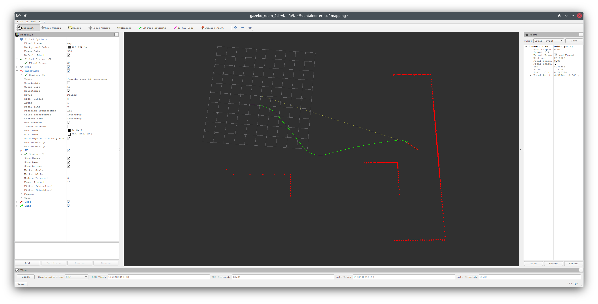

# erl_geometry_ros

[](https://opensource.org/licenses/MIT)
[](http://wiki.ros.org/)
[](https://docs.ros.org/)

**A ROS package providing geometry utilities and data processing nodes for robotics applications.**

`erl_geometry_ros` is a ROS wrapper package for the [erl_geometry](https://github.com/ExistentialRobotics/erl_geometry) library, offering nodes for point cloud processing, 2D simulation data publishing, and LiDAR information extraction. The package supports both ROS1 (Noetic) and ROS2 (Humble) distributions.

## Features

- **Point Cloud Processing**: Load and publish point clouds from various file formats (PCD, PLY, etc.)
- **Gazebo Room 2D Simulation**: Publish synthetic 2D laser scan data for testing and development
- **LiDAR Analysis**: Extract angular information (azimuth/elevation ranges) from point cloud data
- **ROS Support**: Compatible with both ROS1 and ROS2
- **Visualization**: Pre-configured RViz configurations for data visualization

## Installation

### Prerequisites

- ROS1 Noetic or ROS2 Humble
- C++17 compatible compiler
- CMake 3.16 or higher

### Dependencies

This package depends on the following ERL packages:
- `erl_common`
- `erl_covariance`
- `erl_geometry`
- `erl_cmake_tools`

Standard ROS dependencies:
- `geometry_msgs`
- `nav_msgs`
- `sensor_msgs`
- `tf2_ros`
- `std_msgs`

### Building from Source

1. **Clone the repository** into your ROS workspace:
   ```bash
   cd ~/catkin_ws/src  # For ROS1
   # or
   cd ~/ros2_ws/src    # For ROS2

   git clone https://github.com/ExistentialRobotics/erl_geometry_ros.git
   git clone https://github.com/ExistentialRobotics/erl_geometry.git
   git clone https://github.com/ExistentialRobotics/erl_covariance.git
   git clone https://github.com/ExistentialRobotics/erl_common.git
   git clone https://github.com/ExistentialRobotics/erl_cmake_tools.git
   ```

2. **Install dependencies**:
   ```bash
   rosdep install --from-paths . --ignore-src -r -y
   ```

3. **Build the package**:
   ```bash
   # For ROS1
   cd ~/catkin_ws
   catkin build --verbose erl_geometry_ros

   # For ROS2
   cd ~/ros2_ws
   colcon build --packages-up-to erl_geometry_ros
   ```

4. **Source the workspace**:
   ```bash
   # For ROS1
   source ~/catkin_ws/devel/setup.bash

   # For ROS2
   source ~/ros2_ws/install/setup.bash
   ```

## Available Nodes

### 1. `gazebo_room_2d_node`

Publishes synthetic 2D laser scan data from pre-recorded Gazebo simulation data.

**Published Topics:**
- `scan` (sensor_msgs/LaserScan): 2D laser scan data
- `pose` (geometry_msgs/PoseStamped): Robot pose in the map frame
- `path` (nav_msgs/Path): Robot trajectory

**Parameters:**
- `data_folder` (string): Path to the Gazebo data folder (default: "<erl_geometry_pkg>/data/gazebo")
- `laser_frame` (string): Frame ID for laser data (default: "front_laser")
- `map_frame` (string): Map frame ID (default: "map")
- `topic_name` (string): Laser scan topic name (default: "scan")
- `publish_rate` (double): Publishing frequency in Hz (default: 100.0)

### 2. `point_cloud_node`

Loads and publishes point cloud data from files (PCD, PLY, etc.).

**Published Topics:**
- `point_cloud` (sensor_msgs/PointCloud2): Point cloud data

**Parameters:**
- `point_cloud_file` (string): Path to the point cloud file
- `frame_id` (string): Frame ID for the point cloud (default: "map")
- `publish_normals` (bool): Whether to publish normal vectors (default: false)
- `publish_colors` (bool): Whether to publish color information (default: true)

### 3. `get_lidar_info_from_point_cloud`

Analyzes point cloud data to extract LiDAR angular information.

**Subscribed Topics:**
- Point cloud topic (configurable)

**Functionality:**
- Computes azimuth and elevation ranges from point cloud data
- Outputs angular statistics to console

## Usage Examples

### 1. Gazebo Room 2D Simulation



Launch the 2D room simulation with visualization:

```bash
# ROS1
roslaunch erl_geometry_ros gazebo_room_2d.launch

# ROS2
ros2 launch erl_geometry_ros gazebo_room_2d_launch.py
```

This will start:
- The `gazebo_room_2d_node` publishing laser scan data
- Static transform publishers for coordinate frames
- RViz with pre-configured visualization

### 2. Cow and Lady Dataset Visualization


Launch the Cow and Lady dataset visualization:

```bash
# ROS1
roslaunch erl_geometry_ros cow_and_lady.launch

# ROS2
ros2 launch erl_geometry_ros cow_and_lady_launch.py
```

**Note:** You need to set the following environment variables or modify the launch file parameters:
- `cow_and_lady_bag`: Path to the dataset bag file
- `gt_point_cloud_file`: Path to the ground truth point cloud file

### 3. Point Cloud Publishing

To publish a point cloud from a file:

```bash
# ROS1
rosrun erl_geometry_ros point_cloud_node _point_cloud_file:=/path/to/your/pointcloud.pcd _frame_id:=map

# ROS2
ros2 run erl_geometry_ros point_cloud_node --ros-args -p point_cloud_file:=/path/to/your/pointcloud.pcd -p frame_id:=map
```

## Launch Files

### ROS1 Launch Files
- `gazebo_room_2d.launch`: Complete 2D simulation setup with visualization
- `cow_and_lady.launch`: Cow and Lady dataset visualization setup

### ROS2 Launch Files
- `gazebo_room_2d_launch.py`: ROS2 version of the 2D simulation setup
- `cow_and_lady_launch.py`: ROS2 version of the Cow and Lady dataset setup

## RViz Configurations

Pre-configured RViz files are available in the `rviz/` directory for ROS1 or `rviz2/` for ROS2:
- `gazebo_room_2d.rviz`: Configuration for 2D simulation visualization
- `cow_and_lady.rviz`: Configuration for Cow and Lady dataset visualization

## License

This project is licensed under the MIT License - see the [LICENSE](LICENSE) file for details.
